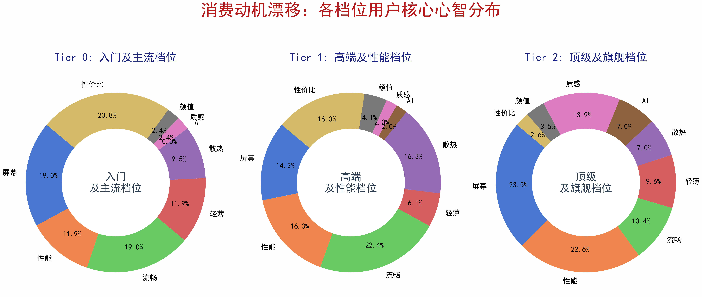
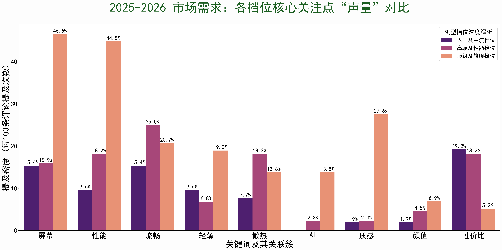

# 💻 算力影子：高端笔记本电脑硬件溢价分析 (数据分析实战)

> 💡 **人机协作模型 (Agentic Workflow)**：本项目采用 **“业务架构师 (Me) + 智能代码助手 (AI Agent)”** 的深度协作模式。我负责业务痛点挖掘、影子价格模型建模、HHI 与 NLP 定权指标构建等核心决策；而 100% 的 ETL 流水线、复杂算法实现及数据可视化代码，均由我调度 AI Agent 辅助完成，展示了 AI 时代下高效的数据科学生产力。

---

## 🔍 1. 为什么做这个项目？(业务实战背景)

在购买笔记本电脑时，厂商往往利用“整机模具”的黑盒属性，将低成本内存、硬盘以数倍于市场的溢价售卖（俗称“黄金内存”）。

**核心问题**：利用电商真实销售数据，通过量化拆解主流品牌的“硬件溢价倍数”，将高端机型中的“黑箱利润”透明化目标。

---

## 📊 2. 核心成果展示 (部分脱敏图表)

为展示项目的可视化能力与核心业务洞察，以下选取了两个关键的可视化片段：

### 📌 可视化 1：不同价位档位的评价维度占比（环形图）

展示了消费者在购买 4000-6000 元（入门）与 10000 元以上（顶级）机型时，关注点（如散热、做工、便携性）的分布差异。



### 📌 可视化 2：不同档位评价关键词对比图

基于 NLP 情感定权后的关键词词云/对比图，直观揭示了各产品线的核心竞争优势与用户痛点差异。



---

## 🤖 3. AI 赋能的分析流水线 (Tech Stack & AI Involvement)

本项目不仅仅是一份分析报告，更是一次 **Agent-centric（以智能体为中心）** 的开发实践：

* **需求转译 (Prompt Engineering)**：将抽象的业务逻辑（如“影子价格”）转化为结构化的 Python 函数。
* **自动化 ETL**：在 AI 辅助下快速构建了从原始数据清洗到 NLP 情感定权的自动化脚本 (`scripts/etl/`)。
* **智能 Debug 与优化**：在处理700多条非结构化评论时，利用 AI 优化了 `jieba` 分词效率与内存管理。

---

## 🧠 4. 核心分析方法与技术路径

我搭建了一个高效的分析流水线：

1. **影子价格模型 (核心亮点) 🌟**：
   * **思路**：控制变量法。计算 `(高配版价格 - 低配版价格) / 存储差量`，求出该品牌对单位存储的“影子估值”。
2. **K-Means 市场聚类 📊**：
   * 利用 `Sklearn` 算法对上百个 SKU 进行无监督降维，将市场划分为“核心办公”、“发烧创作”等 4 个差异化梯队。
3. **消费者弱信号挖掘 (NLP) 💬**：
   * 设计 **“8倍定权法”**，在 AI 辅助优化的清洗逻辑下，从杂乱评论中精准提取“散热调教”、“AI 交互”等真实用户痛点。

---

## 📁 5. 核心数据表与字段说明 (Data Dictionary)

为了保护商业隐私，项目开源的数据（存放在 `data/output/` 下）已统一步改写为 `Brand_A`, `Brand_B` 等代号。以下是项目中最重要的三张表：

### 📝 表1: `品牌硬件溢价对比分析.csv` (最核心的产出)

这张表直观展示了各品牌把硬件包装进电脑后，相比市场成本多赚了多少倍。

* `品牌`：脱敏后的厂商代号 (如 Brand_A)。
* `硬件项目`：指内存或硬盘。
* `厂商升级单价_每GB`：我用影子价格模型算出来的，买该品牌电脑时，每增加 1GB 内存/硬盘实际要付给厂商的钱。
* `零售市场单价_每GB`：基准线（公允价格）。
* `溢价倍率`：核心指标。值越大说明加价越狠。

### 📝 表2: `各品牌影子价格查.csv`

* `平均影子价格` / `中位数价格`：用来排除个别极端机型造成的偏差。
* `价格波动_标准差`：看出该品牌的定价体系是否稳定。

### 📝 表3: `电脑k均值.csv` (聚类结果说明表)

* `Group_prediction`：机器打上的 0、1、2、3 四个分类标签。
* `Count_型号`：该梯队下有多少款电脑（反映市场拥挤度）。
* `Avg_售价`：用来锚定该梯队的用户消费水平（如: 40000 代表高端工作站组）。

## 🛠️ 6. 未来迭代计划 (Learning Roadmap)

1. **可视化底座升级**：当前分析报告主要基于 Python (`Matplotlib`/`Seaborn`) 及其自动化脚本生成。目前我正在钻研 **PowerBI**，计划于近期将脱敏后的动态看板集成至本项目，实现更直观的数据钻取。
2. **算法深度优化**：计划引入更复杂的定价回归模型，进一步剥离“品牌信仰”对硬件溢价的影响权重。

---

## ⚙️ 7. 目录结构与复现方式

```text
├── data/
│   ├── input/       # 源数据 (由于数据合规原因不提供)
│   └── output/      # 脱敏后的各类分析结果 (.csv)
├── scripts/
│   ├── etl/         # 🌟 数据清洗、指标计算、NLP 处理的底层代码库
│   └── local/       # 📊 指标可视化脚本库 (供代码逻辑参考)
├── reports/         # 生产报告相关素材
└── README.md        # 结构文档说明
```

> **运行说明**：环境需安装 `pandas`、`sklearn`、`jieba` 等基础库。为保护数据隐私，`data/input` 源数据未随仓库上传，且 `data/output` 已深度脱敏。因此 `scripts/local` 下的可视化脚本仅作代码逻辑参考，直接运行可能会缺少源文件而报错。

---


